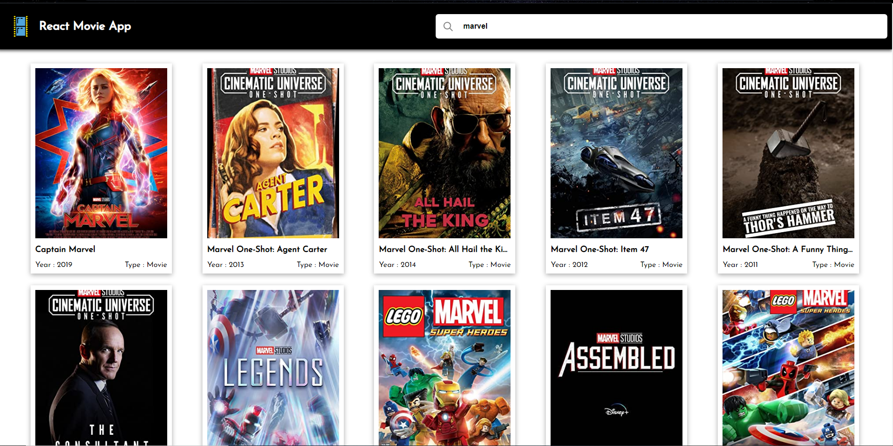

### Movie app


Create an application to show the Database of movies, you can use OMDB API ( https://www.omdbapi.com/ ). 
- Your application should have a list screen to show the top 20 movies of all time. 
- Then it should have a search input where anyone should be able to search for any movie. 
- After searching, it should show a list of all the search results which will contain the list of all the searched movies. 
- On clicking on any of the movie, it should show the detail of that movie including the movie poster, information about the cast, trailers, synopsis, reviews, etc. 

### An overview: 
1. initial page shown to the user is a bunch of preloaded movies
2. when user clicks on the searchbar, he is redirected to the movie that hes searching for
3. when user clicks on the movie card, he is redirected to the details tab.

### Features implemented:
- API setup at OMDB
- UI creation using styled-components
- Debouncing implementation - debouncing literally means we'll be calling the API only when the user completes typing, it doesnt call during every input change in the input field.
- Responsive UI 
- API integration with axios


### Dependencies used:
- axios library 
- styled components 
```bash 
npm i styled-components axios --save
```
- @mui/material 
  
### API used 
- OMDB 
1. create an account
2. they will send the API keys to your registered email address
> so this is the API key, we get, Note that: the significance of `?i=` is explained in these 
```bash 
Here is your key: a96522ba
# OMDB API
http://www.omdbapi.com/?i=tt3896198&apikey=a96522ba
```
> If we want to search a movie based on its moviename we use the `?=s` 
```bash 
https://www.omdbapi.com/?s=avengers&apikey=a96522ba
```

#### Deployment to netlify
```bash
# pushing code for the first time from local to git 
git init
git remote add origin ..
git add -A
git commit -m 'added'
git push -u origin master 

# pushing code afterwords
git add -A
git commit -m 'added'
git pull
git push -u origin master 
```
> create an account on netlify and push to already existing project.

